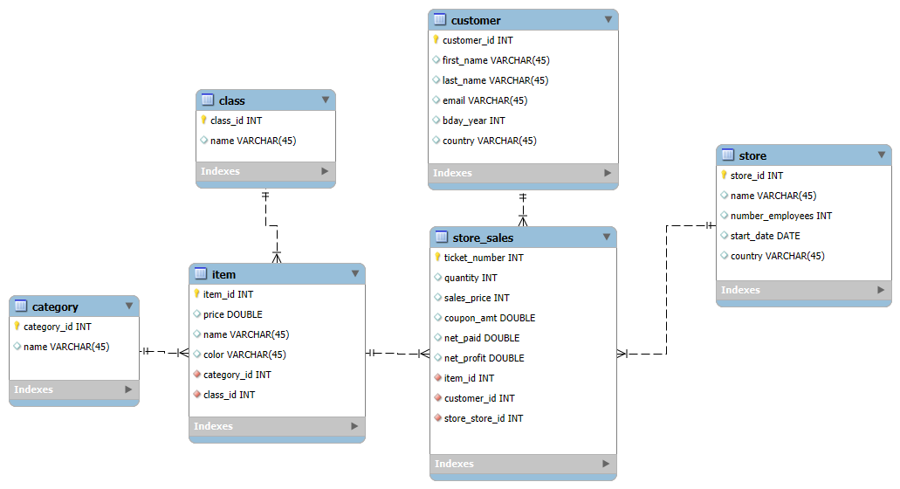
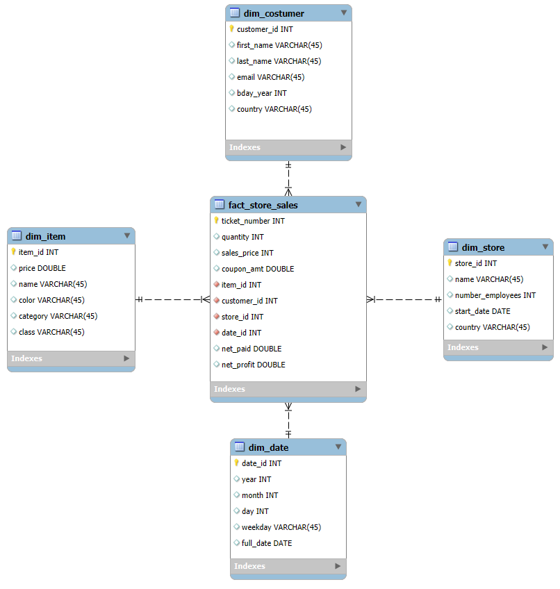
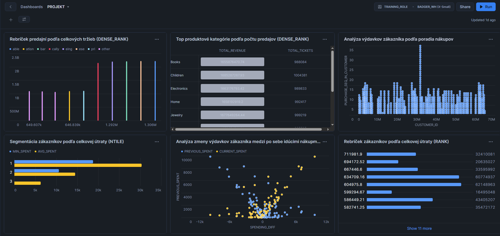

# ELT proces a dátový sklad v Snowflake (TPC-DS)

Tento projekt predstavuje implementáciu ELT procesu v cloudovom dátovom sklade Snowflake s využitím benchmarkového datasetu TPC-DS (Decision Support), ktorý je dostupný prostredníctvom Snowflake Marketplace. Cieľom projektu je návrh a realizácia dátového skladu so schémou Star Schema, ktorý umožňuje efektívnu analytickú prácu nad veľkoobjemovými dátami a podporuje pokročilé analytické scenáre.

---

## 1. Úvod a popis zdrojových dát

Dataset TPC-DS bol zvolený zámerne, pretože:
- simuluje reálne podnikové dátové prostredie veľkého maloobchodného reťazca,
-	obsahuje rozsiahle faktové tabuľky a bohaté dimenzie,
-	predstavuje priemyselný štandard na benchmarkovanie analytických databáz,
-	je vhodný na demonštráciu práce s veľkými dátami (scale factor v terabajtoch).

### 1.1 Biznis kontext a podporovaný proces

Dáta v datasete TPC-DS reprezentujú predajné a zákaznícke procesy multikanálového maloobchodu, ktorý zahŕňa:
-	kamenné predajne (store),
-	online predaj (web),
-	katalógový predaj (catalog).

Dataset podporuje analytiku v oblastiach:
-	predaja a tržieb,
-	správania zákazníkov,
-	výkonnosti produktov a kategórií,
-	časových trendov,
-	porovnania jednotlivých predajných kanálov.


## 2. ERD – pôvodná dátová architektúra

ERD diagram zachytáva pôvodnú normalizovanú štruktúru zdrojových dát. Transakčná tabuľka store_sales realizuje vzťahy typu M:N medzi zákazníkmi, produktmi a predajňami a zároveň uchováva merateľné údaje o predaji.
Priamy vzťah medzi entitami item a store nie je v ERD definovaný, keďže ide o vzťah typu M:N, ktorý je v relačnom modeli realizovaný prostredníctvom transakčnej tabuľky store_sales.
Do ERD diagramu boli zahrnuté iba tie zdrojové tabuľky, ktoré sú priamo využité pri návrhu dátového skladu a analytického modelu. Doplnkové dimenzie (napr. HOUSEHOLD_DEMOGRAPHICS) neboli zahrnuté z dôvodu zjednodušenia modelu a ich nízkej relevancie pre zvolený analytický cieľ.




*Obrázok 1 – Entitno-relačná schéma*

---

## 3. Návrh dimenzionálneho modelu (Star Schema)

Na základe pôvodného relačného modelu bol navrhnutý dimenzionálny dátový model typu Star Schema podľa Kimballovej metodológie. Model pozostáva z jednej centrálnej faktovej tabuľky a viacerých dimenzií, ktoré poskytujú analytický kontext.

### 3.1 Faktová tabuľka

FACT_STORE_SALES predstavuje faktovú tabuľku, ktorá obsahuje:
-	primárny kľúč transakcie,
-	cudzie kľúče na jednotlivé dimenzie,
-	hlavné metriky predaja (tržby, množstvo, zisk).

### 3.2 Dimenzie

Navrhnuté dimenzie sú:
-	DIM_CUSTOMER – údaje o zákazníkoch (SCD Typ 1),
-	DIM_ITEM – informácie o produktoch, kategóriách a triedach (SCD Typ 0),
-	DIM_STORE – údaje o predajniach a ich lokalite (SCD Typ 1),
-	DIM_DATE – časová dimenzia umožňujúca analýzu podľa dní, mesiacov a rokov (SCD Typ 0).

Použitie týchto dimenzií umožňuje multidimenzionálnu analýzu predaja z rôznych pohľadov – časového, produktového, zákazníckeho a geografického.




*Obrázok 2 – Schéma hviezdy*

---

## 4. ELT proces v Snowflake

ELT proces bol implementovaný priamo v Snowflake a pozostáva z troch hlavných fáz:
-	Extract – prevzatie dát zo Snowflake Marketplace,
-	Load – uloženie dát do staging vrstvy,
-	Transform – transformácia dát do analytickej vrstvy.

---

### 4.1 Extract

Zdrojové dáta boli extrahované zo zdieľaného datasetu TPC-DS v Snowflake Marketplace. Dáta boli skopírované do vlastnej databázy a schémy, čím sa zabezpečila nezávislosť analytického riešenia.


**Príklad kódu:**

```sql
USE WAREHOUSE BADGER_WH;
USE DATABASE BADGER_DB;
CREATE OR REPLACE SCHEMA projekt;
USE SCHEMA projekt;

SHOW TABLES IN SCHEMA BADGER_TPCDS_10TB.TPCDS_SF10TCL;
```

---

### 4.2 Load

V tejto fáze boli vytvorené staging tabuľky, ktoré slúžia ako medzivrstva medzi surovými dátami a finálnym analytickým modelom. Dáta boli importované do staging tabuliek pomocou príkazu INSERT INTO. 

**Príklad kódu:**

```sql
CREATE OR REPLACE TABLE CUSTOMER (
  CUSTOMER_ID     INT,
  FIRST_NAME      STRING,
  LAST_NAME       STRING,
  EMAIL           STRING,
  BDAY_YEAR       INT,
  COUNTRY         STRING
);

INSERT INTO CUSTOMER (CUSTOMER_ID, FIRST_NAME, LAST_NAME, EMAIL, BDAY_YEAR, COUNTRY)
SELECT DISTINCT
  C_CUSTOMER_SK        AS CUSTOMER_ID,
  C_FIRST_NAME         AS FIRST_NAME,
  C_LAST_NAME          AS LAST_NAME,
  C_EMAIL_ADDRESS      AS EMAIL,
  C_BIRTH_YEAR         AS BDAY_YEAR,
  C_BIRTH_COUNTRY      AS COUNTRY
FROM BADGER_TPCDS_10TB.TPCDS_SF10TCL.CUSTOMER;

```
---

### 4.3 Transform
V transformačnej fáze boli dáta zo staging tabuliek ďalej spracované, vyčistené a upravené do podoby vhodnej pre analytické účely. Zároveň boli vytvorené jednotlivé dimenzie podľa zvolených typov pomaly sa meniacich dimenzií (SCD) a následne bola naplnená centrálna faktová tabuľka. 

Dimenzia DIM_CUSTOMER obsahuje základné informácie o zákazníkoch, ako sú identifikátor zákazníka, meno, krajina pôvodu a rok narodenia. Táto dimenzia je navrhnutá ako SCD Typ 1, keďže v prípade zmien (napríklad oprava údajov) nie je potrebné uchovávať historické hodnoty.

Dimenzia DIM_ITEM poskytuje informácie o produktoch vrátane názvu produktu, ceny, farby, kategórie a triedy. Keďže údaje o produktoch sú považované za stabilné a nemenia sa v čase, dimenzia je klasifikovaná ako SCD Typ 0.

Dimenzia DIM_STORE obsahuje údaje o predajniach a ich lokalite. Aj táto dimenzia je typu SCD Typ 1, pretože prípadné zmeny údajov (napr. názov alebo adresa predajne) sa aktualizujú bez potreby uchovávania histórie.

Časová dimenzia DIM_DATE slúži na podporu časových analýz a obsahuje odvodené atribúty, ako sú deň, mesiac, rok alebo štvrťrok. Táto dimenzia je navrhnutá ako SCD Typ 0, keďže časové údaje sú nemenné a nové záznamy sa iba dopĺňajú.

Faktová tabuľka FACT_STORE_SALES obsahuje jednotlivé predajné transakcie a prepája ich so všetkými relevantnými dimenziami. Okrem cudzích kľúčov na dimenzie obsahuje aj hlavné metriky predaja, ako sú zaplatená suma, počet predaných kusov a zisk.


**Príklad kódu:**

```sql
CREATE OR REPLACE TABLE DIM_ITEM AS
SELECT
  i.ITEM_ID,
  i.PRICE,
  i.NAME,
  i.COLOR,
  c.NAME  AS CATEGORY,
  cl.NAME AS CLASS
FROM ITEM i
LEFT JOIN CATEGORY c
  ON i.CATEGORY_ID = c.CATEGORY_ID
LEFT JOIN CLASS cl
  ON i.CLASS_ID = cl.CLASS_ID;

SELECT * FROM DIM_ITEM LIMIT 10;

```

## 5. Vizualizácie a analytický dashboard

Navrhnutý dashboard poskytuje komplexný prehľad o správaní zákazníkov, vývoji tržieb a výkonnosti predajní a produktových kategórií. Vizualizácie sú postavené nad dimenzionálnym modelom a zodpovedajú kľúčové manažérske otázky.



*Obrázok 3 – Dashboard datasetu*

---

### Graf 1 – Rebríček predajní podľa tržieb

Tento graf zobrazuje porovnanie jednotlivých predajní na základe dosiahnutých tržieb. Vďaka nemu je možné rýchlo identifikovať, ktoré predajne sú najvýkonnejšie a ktoré naopak zaostávajú.

Význam a využitie grafu:
-	umožňuje benchmarking predajní, teda porovnanie ich výkonnosti medzi sebou,
-	pomáha pri optimalizácii siete prevádzok, napríklad pri rozhodovaní o posilnení alebo obmedzení niektorých predajní,
-	slúži ako podklad pre alokáciu zdrojov, ako sú zamestnanci, marketingový rozpočet alebo zásoby.


```sql
SELECT
    STORE_NAME,
    TOTAL_REVENUE,
    TOTAL_TICKETS,
    DENSE_RANK() OVER (ORDER BY TOTAL_REVENUE DESC) AS STORE_RANK
FROM (
    SELECT
        s.NAME AS STORE_NAME,
        COUNT(f.TICKET_NUMBER) AS TOTAL_TICKETS,
        SUM(f.NET_PAID) AS TOTAL_REVENUE
    FROM FACT_STORE_SALES f
    JOIN STORE s
      ON f.STORE_ID = s.STORE_ID
    GROUP BY s.NAME
) t
ORDER BY STORE_RANK;

```

---

### Graf 2 – Najpredávanejšie produktové kategórie podľa počtu predajov

Cieľom tohto grafu je identifikovať produktové kategórie, ktoré sa predávajú najčastejšie. Graf porovnáva počet predajov jednotlivých kategórií a poukazuje na tie, ktoré majú najväčší záujem zo strany zákazníkov.

Význam a využitie grafu:
-	pomáha pri optimalizácii produktového portfólia, teda rozhodovaní, ktoré kategórie rozvíjať,
-	slúži ako podklad pre plánovanie promo akcií a zliav,
-	podporuje rozhodovanie o skladových zásobách, aby boli najžiadanejšie produkty vždy dostupné.


```sql
SELECT
    CATEGORY_NAME,
    TOTAL_TICKETS,
    TOTAL_REVENUE,
    DENSE_RANK() OVER (ORDER BY TOTAL_TICKETS DESC) AS CATEGORY_RANK
FROM (
    SELECT
        i.CATEGORY AS CATEGORY_NAME,
        COUNT(f.TICKET_NUMBER) AS TOTAL_TICKETS,
        SUM(f.NET_PAID) AS TOTAL_REVENUE
    FROM FACT_STORE_SALES f
    JOIN DIM_ITEM i
      ON f.ITEM_ID = i.ITEM_ID
    GROUP BY i.CATEGORY
) t
ORDER BY CATEGORY_RANK
LIMIT 10;

```

---

### Graf 3 – Analýza výdavkov zákazníka podľa poradia nákupov

Tento graf sleduje, ako sa mení útrata zákazníka pri jeho prvom, druhom, treťom a ďalších nákupoch. Umožňuje analyzovať správanie zákazníkov v čase a zistiť, či ich útrata rastie, stagnuje alebo klesá.

Význam a využitie grafu:
-	poskytuje podklad pre analýzu lojality zákazníkov,
-	pomáha pri identifikácii churnu, teda rizika, že zákazník prestane nakupovať,
-	využíva sa pri optimalizácii marketingových kampaní, napríklad zameraných na opakované nákupy.


```sql
SELECT
  CUSTOMER_ID,
  PURCHASE_SEQ_IN_CUSTOMER,
  NET_PAID,
  SUM(COALESCE(NET_PAID,0)) OVER (
    PARTITION BY CUSTOMER_ID
    ORDER BY PURCHASE_SEQ_IN_CUSTOMER
  ) AS RUNNING_CUSTOMER_SPEND
FROM FACT_STORE_SALES
LIMIT 1000;

```

---

### Graf 4 – Segmentácia zákazníkov podľa celkovej útraty

Graf rozdeľuje zákazníkov do viacerých segmentov na základe ich celkovej útraty. Vďaka tomu je možné rozlíšiť menej aktívnych zákazníkov od tých najhodnotnejších.

Význam a využitie grafu:
-	umožňuje tvorbu cielených marketingových stratégií,
-	podporuje personalizované ponuky prispôsobené jednotlivým segmentom,
-	slúži ako podklad pre strategické CRM rozhodovanie a dlhodobú prácu so zákazníkmi. 

```sql
SELECT
    SPENDING_GROUP,
    COUNT(*)            AS CUSTOMER_COUNT,
    MIN(TOTAL_SPENT)    AS MIN_SPENT,
    MAX(TOTAL_SPENT)    AS MAX_SPENT,
    AVG(TOTAL_SPENT)    AS AVG_SPENT
FROM (
    SELECT
        CUSTOMER_ID,
        SUM(COALESCE(NET_PAID, 0)) AS TOTAL_SPENT,
        NTILE(3) OVER (ORDER BY SUM(COALESCE(NET_PAID, 0)) DESC) AS SPENDING_GROUP
    FROM FACT_STORE_SALES
    GROUP BY CUSTOMER_ID
) t
GROUP BY SPENDING_GROUP
ORDER BY SPENDING_GROUP;

```

---

### Graf 5 – Analýza zmeny výdavkov medzi jednotlivými nákupmi
Tento graf sleduje rozdiel v útrate zákazníka medzi po sebe nasledujúcimi nákupmi. Zameriava sa na to, či zákazník míňa viac alebo menej než pri predchádzajúcom nákupe.

Význam a využitie grafu:
-	umožňuje identifikovať zmeny v správaní zákazníkov,
-	pomáha pri včasnom odhalení rizika churnu,
-	slúži na hodnotenie efektivity promo kampaní a marketingových zásahov. 

```sql
SELECT
    CUSTOMER_ID,
    TICKET_NUMBER,
    NET_PAID AS CURRENT_SPENT,
    LAG(NET_PAID) OVER (
        PARTITION BY CUSTOMER_ID
        ORDER BY TICKET_NUMBER
    ) AS PREVIOUS_SPENT,
    NET_PAID - LAG(NET_PAID) OVER (
          PARTITION BY CUSTOMER_ID
          ORDER BY TICKET_NUMBER) AS SPENDING_DIFF
FROM FACT_STORE_SALES
WHERE NET_PAID IS NOT NULL
QUALIFY PREVIOUS_SPENT IS NOT NULL
LIMIT 100;

```

---

### Graf 6 – Rebríček zákazníkov podľa celkovej útraty
Tento graf vytvára prehľad zákazníkov zoradených podľa výšky ich celkovej útraty. Umožňuje identifikovať zákazníkov, ktorí generujú najväčšiu časť tržieb.

Význam a využitie grafu:
-	slúži na identifikáciu VIP zákazníkov,
-	podporuje personalizované marketingové kampane zamerané na najhodnotnejších zákazníkov,
-	využíva sa pri Pareto analýze (princíp 80/20), kde malá časť zákazníkov generuje väčšinu tržieb. 

```sql
SELECT
    CUSTOMER_ID,
    TOTAL_SPENT,
    RANK() OVER (ORDER BY TOTAL_SPENT DESC) AS CUSTOMER_RANK
FROM (
    SELECT
        CUSTOMER_ID,
        SUM(NET_PAID) AS TOTAL_SPENT
    FROM FACT_STORE_SALES
    WHERE NET_PAID IS NOT NULL
    GROUP BY CUSTOMER_ID
) t
ORDER BY CUSTOMER_RANK
LIMIT 20;

```

---

# Záver
Navrhnutý ELT proces a dátový sklad v Snowflake umožňujú efektívnu analýzu veľkoobjemových retail dát. Použitie Star Schema, window functions a analytických vizualizácií poskytuje hlboký pohľad na správanie zákazníkov a výkonnosť predaja.

---

Autori: Bernadett Baloghová, Chloe Pódová
